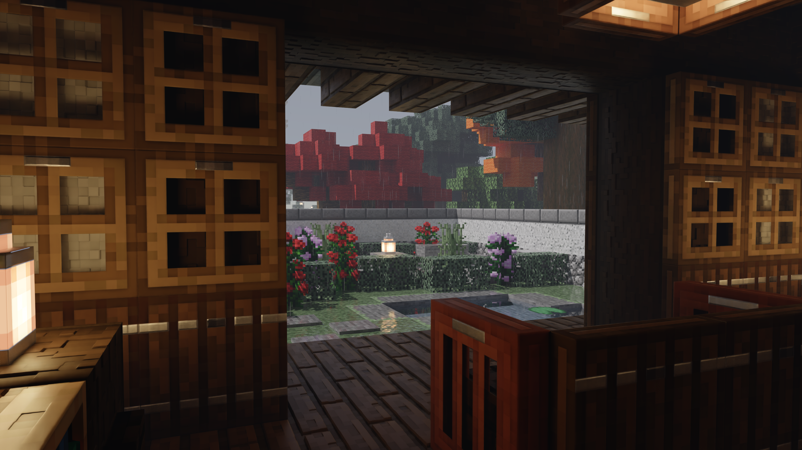
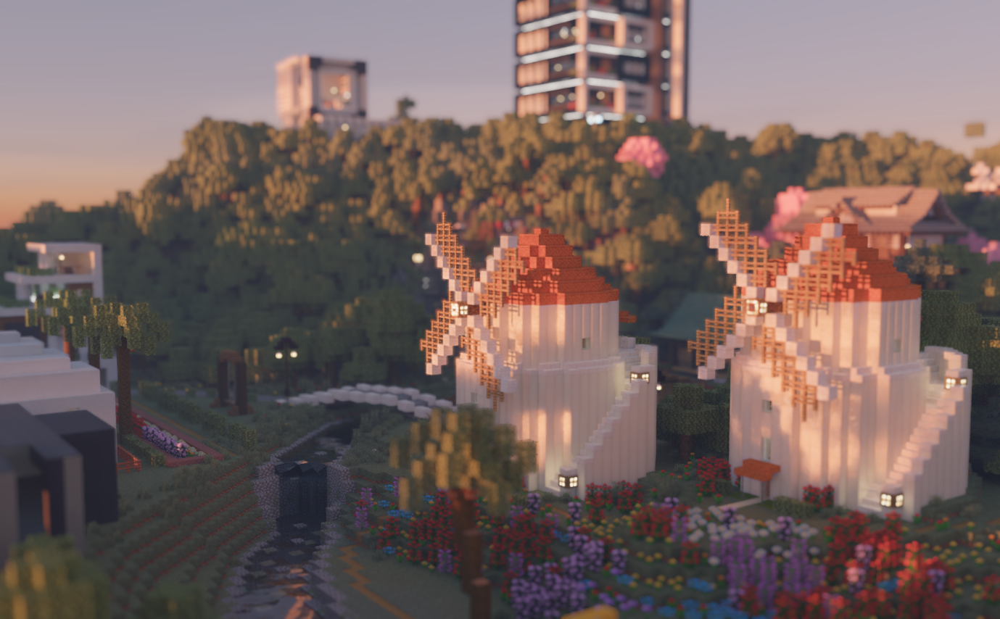
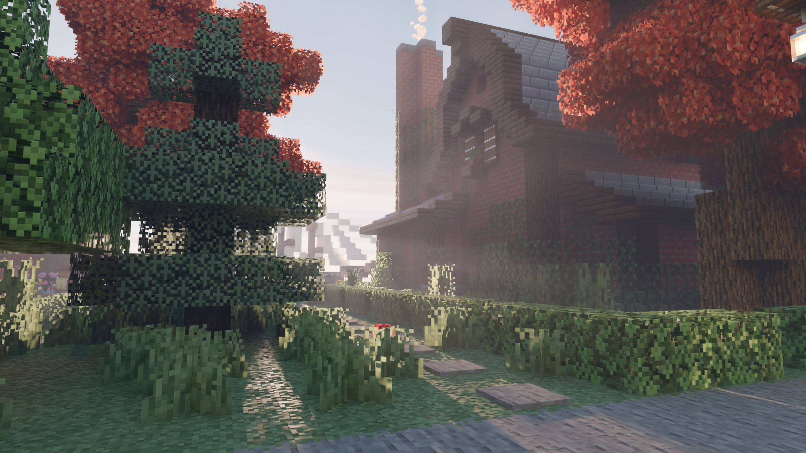
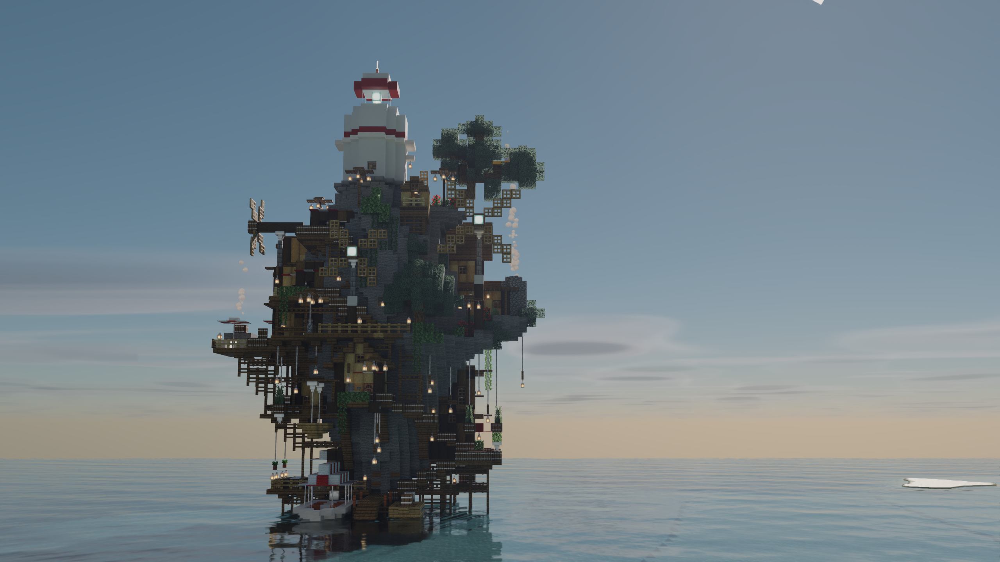

> **原作者声明：** 本项目基于 [ComfyFluffy/Caustica](https://github.com/ComfyFluffy/Caustica)，原 Mod 作者为 **i**。感谢原作者及贡献者的工作。此仓库由 **LIWED** 在原 Mod 基础上添加功能并维护，属于非官方分支，版本 **0.5** 为本分支版本。

# Caustica 0.5

Caustica 是用于 Minecraft 26.2 的光线追踪渲染 Mod。本分支保留原 Mod 的光线追踪、DLSS 光线重建、帧生成和 HDR 功能，在此基础上增加水体、天气、材质和镜头效果，让日常游玩与建筑摄影有更多可调选项。

## 在原 Mod 基础上添加与改进的功能

- **水体效果**：动态水波、浅水焦散、水下雾气与光束；可调整水波幅度、水体透明度和水雾强度。
- **雨雪与湿润地表**：雨天的地面湿润、积水反射、涟漪和落地水花；停雨后逐渐变干，并改善雪花飘落效果。
- **云层与天气光照**：随天气变化的云层、云影和日光遮挡，让晴天、雨天与雷暴呈现不同的亮度和氛围。
- **雾气与体积光**：空气雾随时段和天气变化；可调整基础浓度、雨天与雷暴增量、日出日落及正午浓度，以及光束的衰减强度。
- **材质凹凸效果**：支持带高度信息的 LabPBR 资源包，使砖石等方块表面呈现更明显的凹凸、缝隙与阴影，可调整效果深度。
- **景深与镜头控制**：自动对焦、固定远景对焦、可调景深与画面缩放，方便拍摄建筑、近景和微缩风格画面。
- **更便于使用的设置**：光追选项按渲染、材质、曝光、景深、水体、雾气、云层和调试分组，提供中英文说明。
- **画面修正**：修复帧生成开启时的全屏抖动和船内部紫色平面，改善日出日落时的云影稳定性。

## 游戏截图

以下图片来自本分支的游戏内截图，画面也会受到资源包、场景与设置的影响。

### 雨天庭院与室内灯光

### 日落风车与景深

### 日间建筑与空气雾

### 水上建筑、反射与浅水焦散

### 海上高塔与远景

## 下载与安装

本分支的 Mod JAR 与源码压缩包通过 [GitHub Releases](https://github.com/LIWED/Caustica-fork/releases) 提供。

1. 使用 **Minecraft 26.2** 和 **Java 25 或更新版本**。
2. 安装 **Fabric Loader 0.19.3 或更新版本**及对应的 **Fabric API**。
3. 将 `caustica-0.5.jar` 放入游戏实例的 `mods` 文件夹，移除或禁用旧版 Caustica JAR。
4. 使用 **Vulkan 图形后端**启动游戏。
5. 在视频设置中调整光线追踪、水体、天气和镜头选项。

源码压缩包用于查看和修改项目，不能作为 Mod 安装。想使用材质凹凸效果，需要搭配包含高度信息的 LabPBR 资源包。

## 运行要求

- 支持 Vulkan 光线追踪的显卡与驱动。
- DLSS 光线重建和帧生成需要受支持的 NVIDIA RTX 显卡与驱动；帧生成仍为实验功能。
- HDR 需要支持 HDR 的显示器，并开启系统 HDR；Linux 下还需要支持 HDR 的原生 Wayland 会话。
- 本 Mod 仅在客户端运行。其他接管世界渲染或图形后端的 Mod 可能产生冲突。
- 如果游戏在崩溃后自动切回 OpenGL，请重新启用 Vulkan 后端。

## 项目链接

- [本分支与问题反馈](https://github.com/LIWED/Caustica-fork)
- [原作者项目](https://github.com/ComfyFluffy/Caustica)
- [原项目 Discord](https://discord.gg/SeWCjyKu2)
- [原 Mod 的 Modrinth 页面](https://modrinth.com/mod/caustica)
- [原 Mod 的 CurseForge 页面](https://www.curseforge.com/minecraft/mc-mods/caustica/preview)

## 许可证

项目自有源码与文档沿用 **GNU LGPL v3.0 或更新版本**。详见 [LICENSE.md](LICENSE.md)、[COPYING](COPYING) 和 [COPYING.LESSER](COPYING.LESSER)。

发布包中包含的 NVIDIA DLSS/NGX 组件适用 NVIDIA 的许可条款，详见 [THIRD_PARTY_NOTICES.md](THIRD_PARTY_NOTICES.md)。
